# 网上花城项目 README

## 一、项目概述

**项目简介**：本网站是一个网上鲜花销售系统，开发目的是旨在为用户提供便捷、高效的在线鲜花购买服务，同时帮助商家高效管理订单和库存。系统具备完善的功能，包括但不限于鲜花展示模块、鲜花信息模块，能让顾客清晰浏览各类鲜花的品种、颜色、价格、花语等详细信息。拥有便捷的购物车功能，方便消费者添加、删除和修改购买意向的鲜花商品。订单管理系统可实现从下单、支付到订单跟踪等一系列流程的高效处理。用户管理模块确保了商家和消费者的信息安全与便捷操作，商家可对店铺信息、鲜花库存等进行管理，消费者可对个人资料和购买历史进行查看与编辑。 本项目后端基于 `Django` 框架，前端基于Vue框架，希望能打造一个稳定、可靠且易于扩展的鲜花销售系统，满足鲜花市场的线上交易需求。

**项目背景**：网站开发原因，如 “随着线上购物的流行，鲜花市场需要一个专门的在线销售系统以满足消费者和商家的需求。

## 二、技术栈
开发环境：`Pycharm` + `Vscode`

开发平台:鉴于 `python` 语言的跨平台性，本项目可在 `windows`、`Linux`及 `mac` 操作系统上运行。

后端： `Django 4.26` + `jijia2`模板引擎 - 一个高级的 `Python Web` 框架，用于处理服务器端逻辑、路由和数据库交互。

前端：`HTML5`、`CSS3`及`Vue.js` - 用于前端页面动态渲染和实现交互效果。

数据库：`MySQL 8.0` - 用于存储网站的用户信息、订单数据、鲜花产品信息和库存数据。`Redis 6.2` 实现缓存功能，提高网站性能

其他工具 / 技术：分布式文件系统；RabbitMQ消息队列（此项目未使用）；

外接API：支持支付宝支付——沙箱服务，手机验证码注册——容联云，管理系统设计——`simple ui`。

软件环境：限制于`html5`及`css3`更新，页面渲染在浏览器版本`ie>9.0`以上体验更佳。


## 三、项目结构

项目的主要目录和文件结构：
```python
/flower_shop：为了获取网站数据，开发了网站爬虫用于获取数据，运行spider项目即可往相应的数据库中写入鲜花内容和价格信息等。
    /apps：包含网站的主要应用，包括用户应用、内容应用、购物车应用、订单应用、商品应用，各个应用中包含该应用的主要代码，其中models.py定义数据模型，views.py处理业务逻辑，urls.py负责路由。
    /settings: 主要项目配置文件，包含开发环境和部署环境，具体在manager.py中配置。
    /templates：存放 HTML 模板文件。
    /static：用于存储 CSS、JavaScript 和图片等静态资源。
    /utils：项目可能使用的其他扩展。
/docs:网站设计过程中仍保存的文档，用于帮助回忆部分内容。
```

## 四、安装与运行
### 1.克隆项目，本地安装`mysql-server`和`redis-server`。

### 2.配置环境，建议创建虚拟环境，项目所需依赖环境文件处于`requiremnets.txt`中。
```shell
# 建议切换清华源安装
pip config set global.index-url https://pypi.tuna.tsinghua.edu.cn/simple
pip3 install -r requiremnets.txt
```

### 3.项目配置
创建数据库`flower`，编码为`utf8`:
```mysql
create database flower charset=utf8;
```
在`dev`文件中修改`redis`和`mysql`对应的`IP`和端口。
```python
CACHES = {
    "default": { # 默认
        "BACKEND": "django_redis.cache.RedisCache",
        "LOCATION": "redis://127.0.0.1:6379/0",
        "OPTIONS": {
            "CLIENT_CLASS": "django_redis.client.DefaultClient",
        }
    },
    # ...
}
DATABASES = {
    'default': {
        # 'ENGINE': 'django.db.backends.sqlite3',
        # 'NAME': BASE_DIR/'db.sqlite3',
        'ENGINE': 'django.db.backends.mysql', # 数据库引擎
        'HOST': '127.0.0.1', # 数据库主机
        'PORT': 3306, # 数据库端口
        'USER': 'shelhen', # 数据库用户名
        'PASSWORD': 'aorT2lIpjHTRF25X', # 数据库用户密码
        'NAME': 'flower' # 数据库名字
    }
}
```

### 4.数据库迁移和更新数据
```shell
python manage.py migrate
python flower_shop/utils/HuaSpider.py
```
如果数据库迁移失败，请尝试清空迁移内容，重新生成：
```shell
# python manage.py makemigrations --empty appname
# 分别清空所有的内容，将上述appname换成user、content等
python manage.py makemigrations
python manage.py migrate product
# 依次迁移
python manage.py migrate
# 爬去数据
python flower_shop/utils/HuaSpider.py
```
最后运行`...flower-shop/flower_shop/utils/HuaSpider.py`中的代码自动爬取图片和商品数据。

### 5.运行项目，访问`http://127.0.0.1:8000`即可见网站`C`端。

```shell
python manage.py runserver：8000
```

> 说明：项目运行后，小部分内容还需要微调，如手机验证码服务、支付宝支付服务....，由于配置手机注册账户将为复杂，考虑提供一些体验账号，待更新。

### 6.配置后台管理系统
项目如果正常运行，可创建管理员账号进入管理系统，其中后台管理系统由`django`自动升层，管理系统等前端美化借助了`simple-ui`插件，有收费的没用，自己调整了下，有需要自定义的可以自己参考相关文档。
```shell
python manage.py createsuperuser
# 修改密码
# python manager.py changepassword 
# python manage.py shell 
# from django.contrib.auth import get_user_model 
# User = get_user_model().objects.get(pk=1)
# User.set_password('root')
# User.save()
```
配置完毕后，访问`http://127.0.0.1:8000/admin`输入创建时定义的账号和密码即可进入管理系统。

## 五、功能介绍
### 1.用户功能：

注册与登录：用户可以创建新账户或使用已有账户登录，确保信息安全。


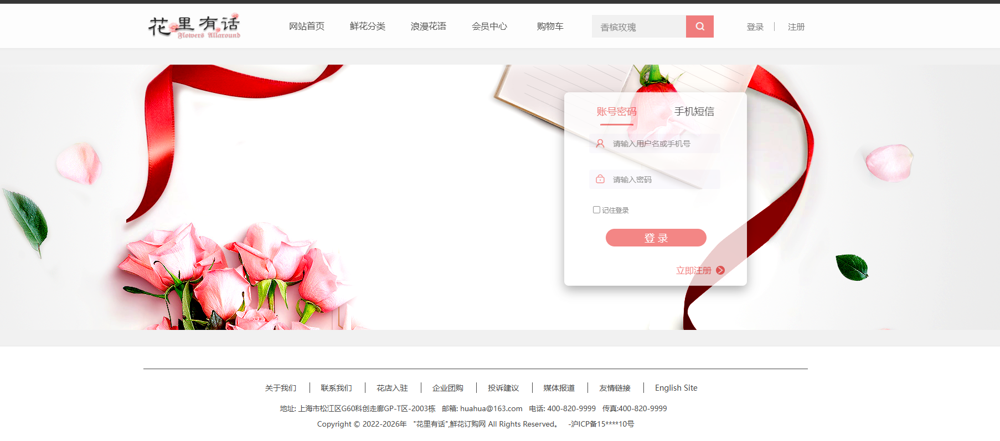
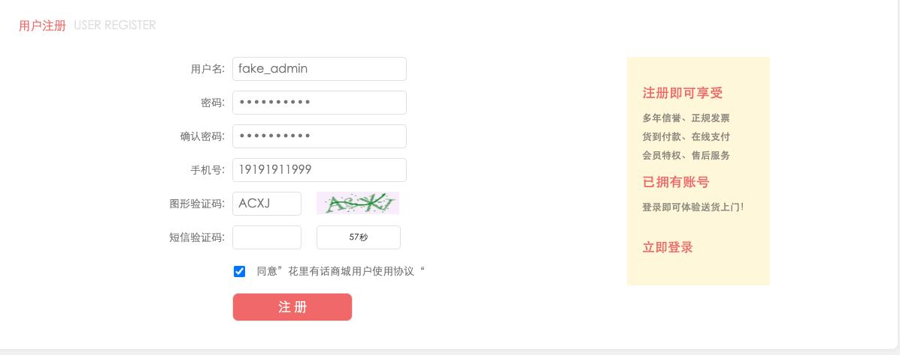

> 关于注册：需要接入真正的手机验证码的请自行配置，这里用于测试，会将验证码在后端服务输出。


 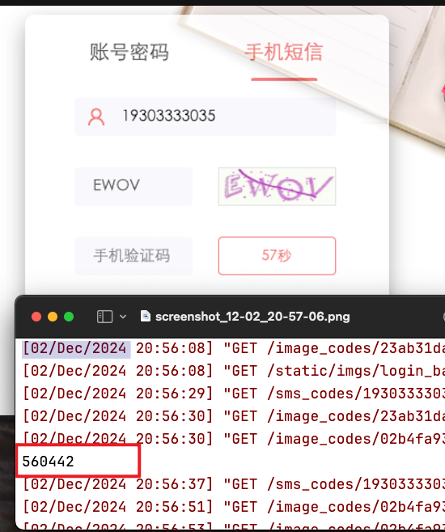


浏览鲜花：在首页或分类页面查看各种鲜花产品，包括鲜花图片、名称、价格、描述等详细信息。


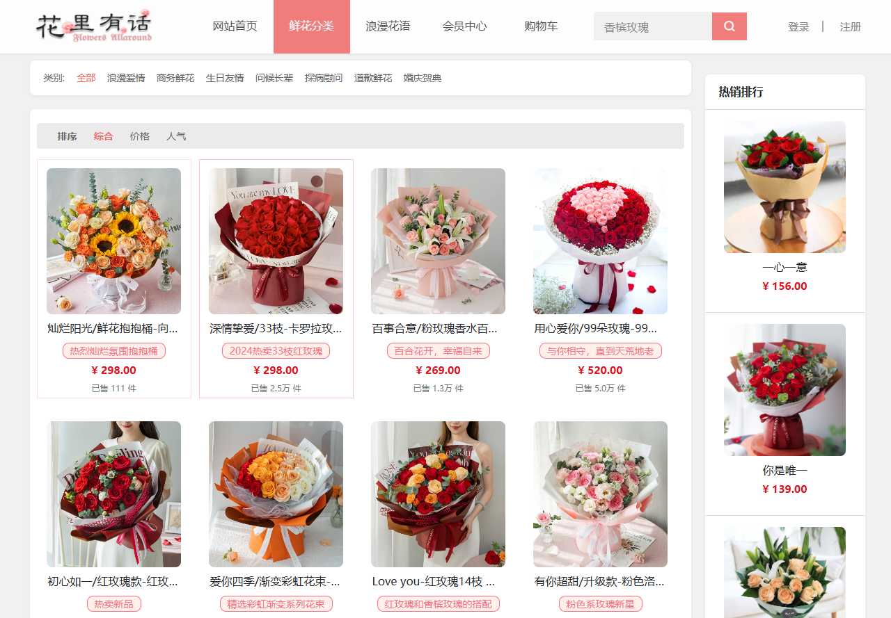


商品详情：可在商品详情进一步查询鲜花信息。
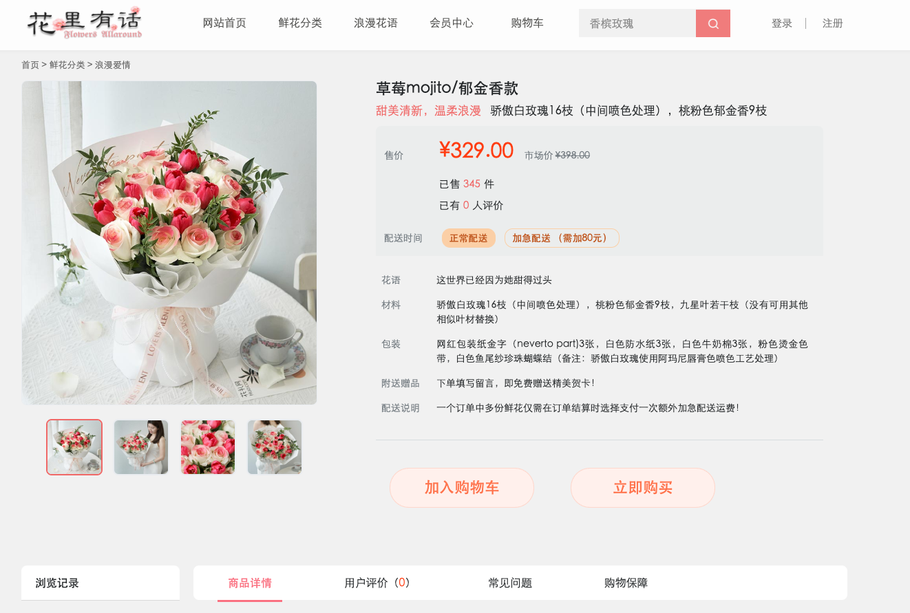
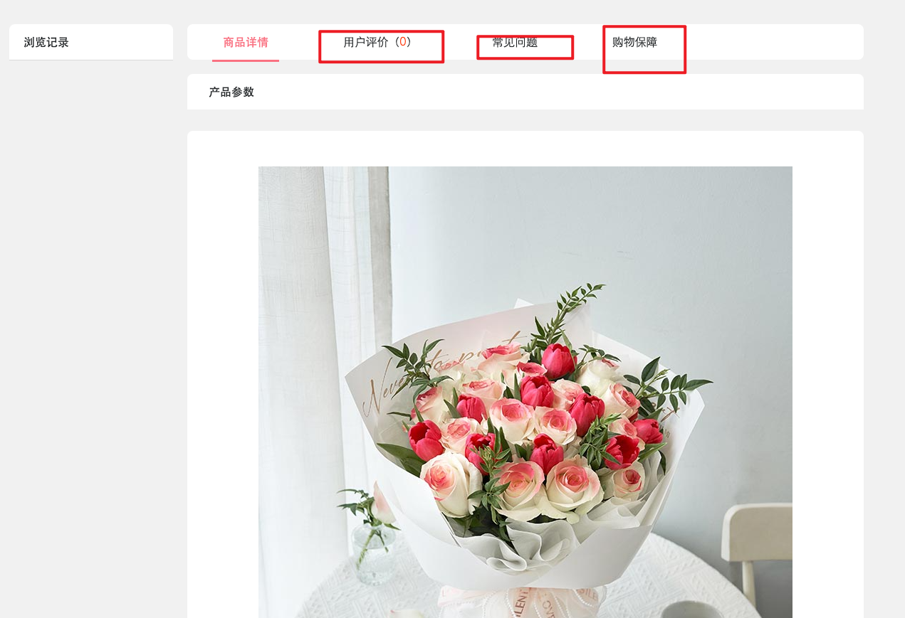
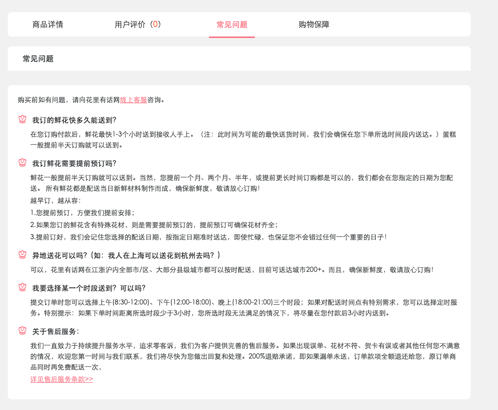


花语信息：
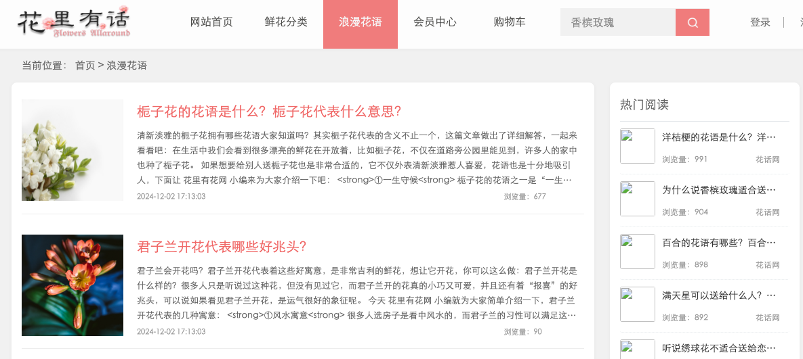

购物车管理：将心仪的鲜花加入购物车，可修改数量、删除商品，在购物车中查看总价。
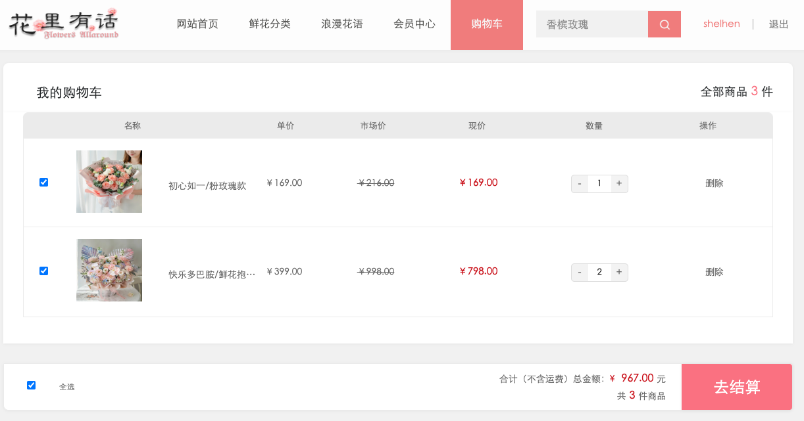
会员中心：
可以进行收多地址、订单管理等操作....
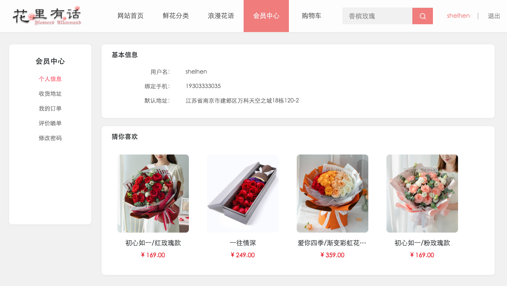
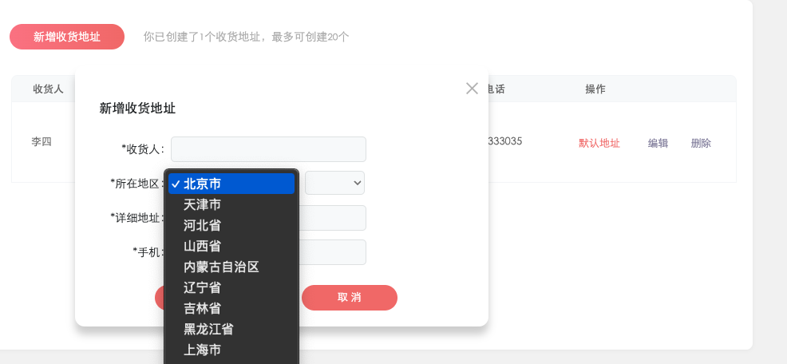

下单与支付：完成购物后进行下单操作，选择支付方式（如 [具体支付方式，如支付宝支付]）完成购买。
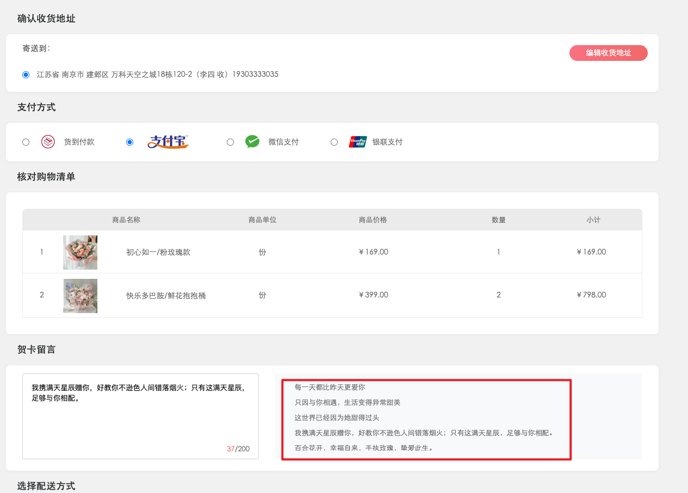

> 支付宝支付需要自行参考阿里支付的api，项目中提供了参考模版，另外，2年前开发时申请了支付宝沙箱账号账号：lusvqu1291@sandbox.com，支付密码：111111，使用者可以暂时使用体验支付功能。可能大概也许早就不能用了。

订单跟踪：用户可以查看订单状态，包括已支付、已发货、已送达等。
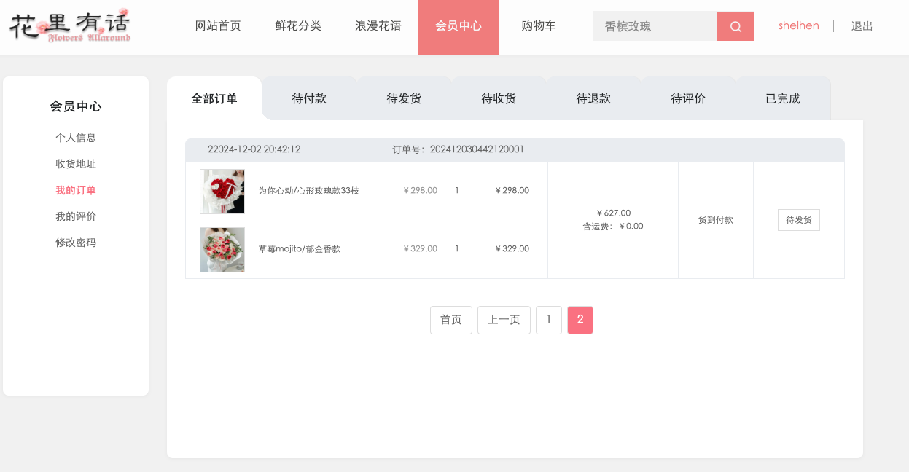


## 2.商家功能：
数据中台：

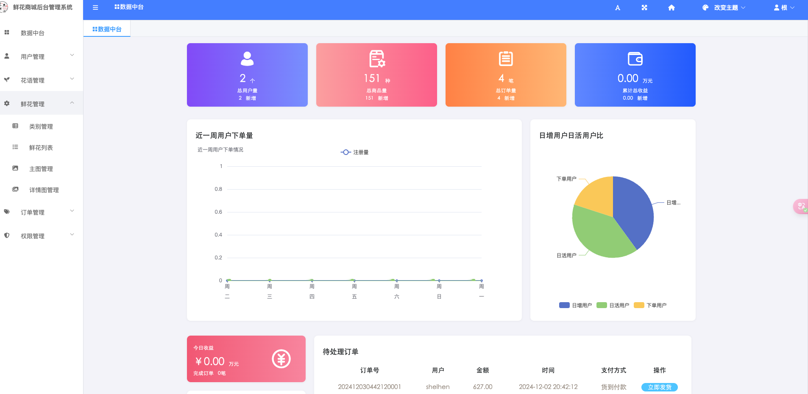
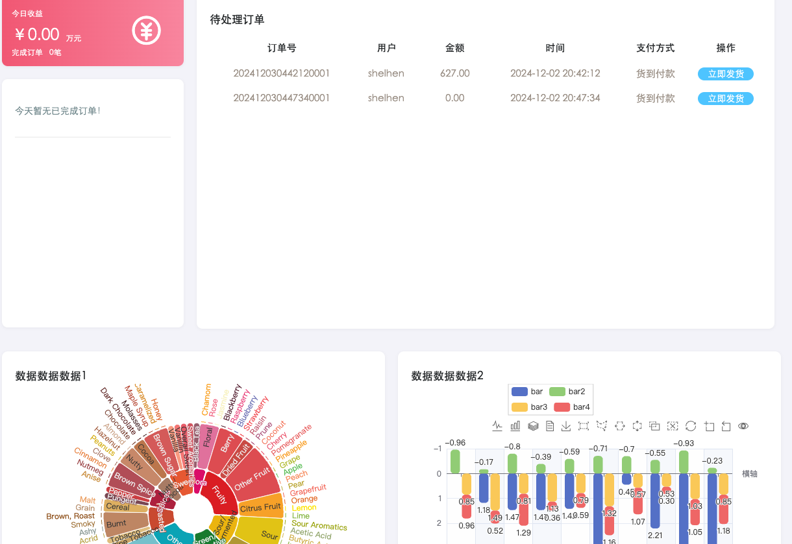


商品管理：添加、编辑、删除鲜花产品信息，包括上传鲜花图片、更新价格和库存。
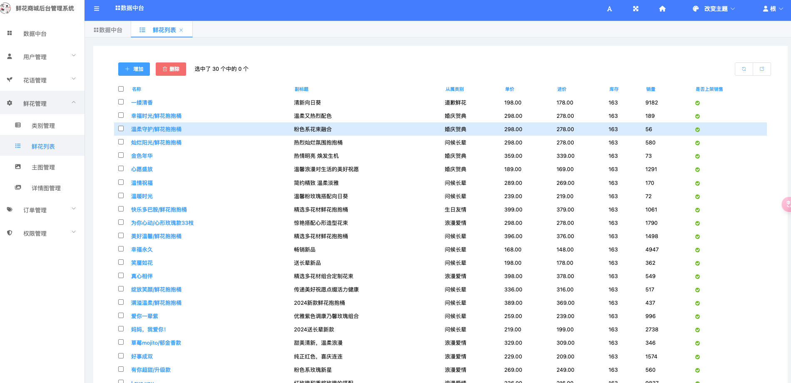


订单处理：查看新订单，更新订单状态，处理发货等相关操作。
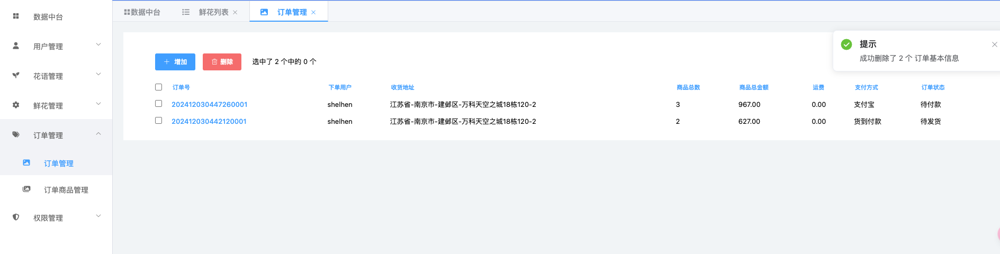

主页管理、权限管理、花语信息管理等等。。。

## 六、联系信息

有任何问题欢迎提Issue，或将问题描述发送至我邮箱 shelhen@163.com，我会尽快解答，推荐以提交Issue方式。

